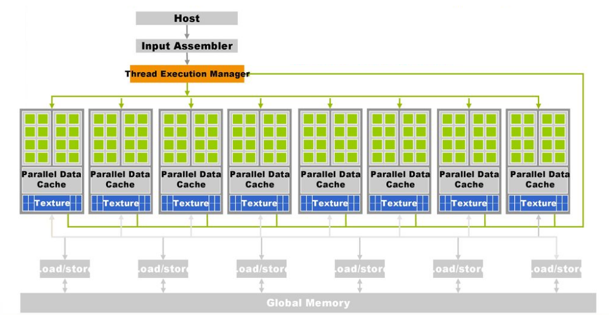

<h1 align="center">
    <b>
        <br>
        # Tugas Besar 3 IF3230 Sistem Paralel dan Terdistribusi
        <br>
    </b>
</h1>

<h2 align="center">
    <b>
        <br>
        Cuda - Dijkstra Algorithm
        <br>
        <br>
    </b>
</h2>

## Petunjuk Penggunaan Program
* Compile: <br>
  ketikan ```make``` pada direktori tempat ```makefile``` berada

## Laporan Pengerjaan
### Deskripsi Solusi Paralel
Solusi paralel yang dilakukan adalah data parallelism karena data yang ada dibagi-bagi ke *thread* yang ada, sehingga *thread* pusat hanya bertugas untuk menerima hasil dari pemrosesan algoritma dijkstra yang dilakukan oleh *thread* lain. Hasil pemrosesan algoritma dijkstra merupakan satu baris dari matriks jarak antar node. <br>
<div align="center">
    
</div>

Cara kerja program:
1. Program menginisiasi graf dalam bentuk matriks berukuran N x N
2. Untuk setiap baris dan kolom, program mengisi nilai *random* yang didapat dari funsi ```rand()``` dengan seed ```13517020``` atau ```13517137```
3. Program mulai menjalankan algoritma dijkstra untuk mencari nilai cost minimum yang dibutuhkan dari node-x untuk mencapai node-y
   * Jika jumlah *thread* dan *block* yang digunakan hanya 1, program akan menjalankan algoritma dijkstra secara serial
   * Jika jumlah *thread* yang digunakan lebih dari 1, program akan menjalankan algoritma dijkstra secara paralel
     * *host* akan menerima hasil pemrosesan graf menggunakan algoritma dijkstra dari *thread-thread* lain
     * *thread* akan melakukan pemrosesan graf menggunakan algoritma dijkstra untuk dikirimkan ke *host*

### Analisis Solusi
* Kelebihan:
  * Setiap *thread* membaca dari satu memory yang sama
  * Jika *thread* yang digunakan hanya 1 program akan langsung menjalankan algoritma dijkstra secara serial
  * Lebih hemat *memory space* karena alokasi *memory* menyesuaikan input jumlah nodes
* Kelemahan:
  * Karena menggunakan satu server, perbedaan waktu yang dibutuhkan antara 1 *thread*, 2 *thread*, 3 *thread*, dst. tidak berbeda jauh
* Solusi yang lebih baik:
  * Dapat menggunakan beberapa server tetapi disaat yang bersamaan masih dapat mengakses *memory* yang sama

### Jumlah Thread dan Block yang Digunakan
Pada percobaan kami menggunakan 256 *thread* dan membandingkan waktu yang dibutuhkan untuk setiap jumlah *block* yang dipakai. Pada akhirnya kami memutuskan penggunaan 6 *block* karena dari hasil percobaan kami, waktu yang dibutuhkan untuk mendapatkan solusi dengan menggunakan 6 *block* sedikit lebih cepat dibandingkan jika menggunakan 5 *block*, 4 *block*, 3 *block*, 2 *block* dan 1 *block* dan jauh lebih cepat dibandingkan jika menggunakan serial. Hal ini disebabkan oleh jumlah data yang dibagi untuk setiap *thread* menurun sesuai dengan banyaknya *block* yang digunakan sehingga *thread* dapat menyelesaikan tugasnya lebih cepat.
<div align="center">
    
</div>
<div align="center">
    
</div>

### Pengukuran Kinerja Algoritma Paralel dengan Serial
| Jumlah Thread |  Jumlah Block | Jumlah Node |  Waktu  1 (μs) |  Waktu  2 (μs) |  Waktu  3 (μs) |
|:-------------:|:-------------:|:-----------:|:--------------:|:--------------:|:--------------:|
|   1 (Serial)  |   1 (Serial)  |         100 |     623712.000 |     587962.000 |     560291.000 |
| 256 (Paralel) |   1 (Paralel) |         100 |     164386.000 |     147777.000 |     145426.000 |
| 256 (Paralel) |   2 (Paralel) |         100 |     172299.000 |     145077.000 |     140566.000 |
| 256 (Paralel) |   3 (Paralel) |         100 |     150925.000 |     224784.000 |     223830.000 |
| 256 (Paralel) |   4 (Paralel) |         100 |     176665.000 |     174815.000 |     231577.000 |
| 256 (Paralel) |   5 (Paralel) |         100 |     155048.000 |     150228.000 |     151904.000 |
| 256 (Paralel) |   6 (Paralel) |         100 |     145448.000 |     161312.000 |     154741.000 |
|   1 (Serial)  |   1 (Serial)  |         500 |   75160418.000 |   65273596.000 |  119944588.000 |
| 256 (Paralel) |   1 (Paralel) |         500 |     180292.000 |     164551.000 |     177427.000 |
| 256 (Paralel) |   2 (Paralel) |         500 |     266037.000 |     147421.000 |     178464.000 |
| 256 (Paralel) |   3 (Paralel) |         500 |     197375.000 |     185566.000 |     264603.000 |
| 256 (Paralel) |   4 (Paralel) |         500 |     164533.000 |     170388.000 |     194320.000 |
| 256 (Paralel) |   5 (Paralel) |         500 |     188728.000 |     157579.000 |     180280.000 |
| 256 (Paralel) |   6 (Paralel) |         500 |     162918.000 |     168775.000 |     159775.000 |
|   1 (Serial)  |   1 (Serial)  |        1000 |  854432961.000 |  945121239.000 |  960922525.000 |
| 256 (Paralel) |   1 (Paralel) |        1000 |     229099.000 |     240549.000 |     232307.000 |
| 256 (Paralel) |   2 (Paralel) |        1000 |     243702.000 |     222493.000 |     238901.000 |
| 256 (Paralel) |   3 (Paralel) |        1000 |     243625.000 |     270797.000 |     248938.000 |
| 256 (Paralel) |   4 (Paralel) |        1000 |     250706.000 |     215269.000 |     250706.000 |
| 256 (Paralel) |   5 (Paralel) |        1000 |     233965.000 |     210680.000 |     256616.000 |
| 256 (Paralel) |   6 (Paralel) |        1000 |     260464.000 |     242144.000 |     255871.000 |
|   1 (Serial)  |   1 (Serial)  |        3000 |   12025569.000 |   12013395.000 |   12205896.000 |
| 256 (Paralel) |   1 (Paralel) |        3000 |     397940.000 |     360637.000 |     407249.000 |
| 256 (Paralel) |   2 (Paralel) |        3000 |     410451.000 |     466173.000 |     369772.000 |
| 256 (Paralel) |   3 (Paralel) |        3000 |     470515.000 |     465059.000 |     518895.000 |
| 256 (Paralel) |   4 (Paralel) |        3000 |     496052.000 |     464860.000 |     358233.000 |
| 256 (Paralel) |   5 (Paralel) |        3000 |     474651.000 |     462856.000 |     380211.000 |
| 256 (Paralel) |   6 (Paralel) |        3000 |     393069.000 |     358095.000 |     363772.000 |

### Analisis Perbandingan Kinerja Serial dan Paralel
Algoritma dijkstra yang dijalankan secara serial memakan waktu jauh lebih lama dibandingkan dengan algoritma dijkstra yang dijalankan secara paralel karena jumlah server yang digunakan sama antara serial dengan paralel.

## Pembagian Tugas
* 13517020 mengerjakan convert fungsi algoritma dijkstra openMP to Cuda
* 13517137 mengerjakan makefile dan laporan